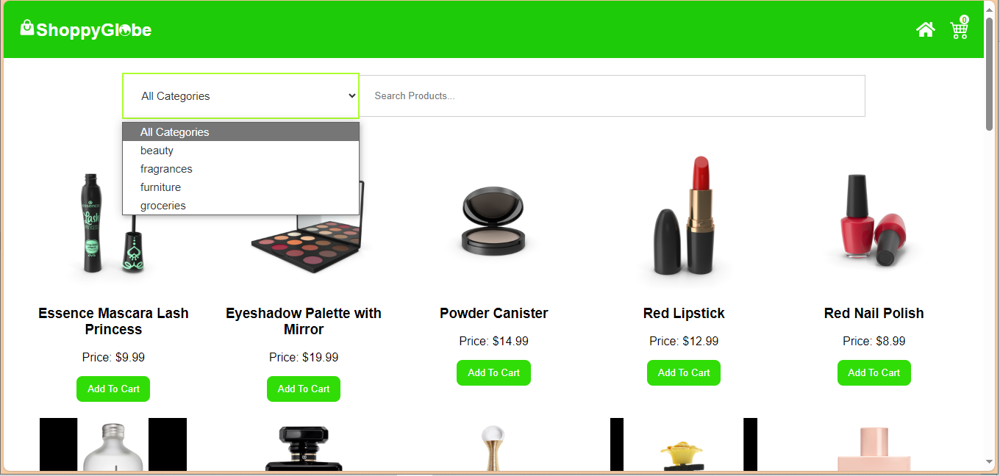
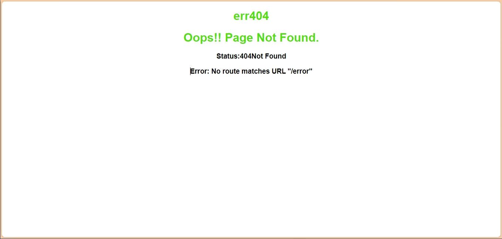

# ShoppyGlobe E-commerce Application
A e-commerce application built using Vite, React, and Redux.

## Feature's
- Simple UI/UX: A clean and user-friendly interface for seamless user experience.
- Good Resource Management: Efficient handling of resources to ensure optimal performance.
- Home Page: Displays a comprehensive list of products.
- Product Detail Pages: Provides detailed information about each product.
- Cart, CartItem, & CartCheckout: Uses Redux to manage cart items, including adding, removing, and updating quantities.
- Error Handling: Graceful management of API call failures.
- Lazy Loading: Uses Suspense for efficient routing between pages.

# Comments
- Use comments sparingly for major logic or computations.
- Maintain clean and readable code.

## Concepts Learned
- React Fundamentals
- Advanced React
- Redux for State Management
- Data Fetching and API Integration
- Event Handling
- Styling and Responsive Design-Pure_CSS
- Performance Optimization
- Version Control-Git & GitHub
- Project Structure and Organization
- Debugging and Testing

## Prerequisites
- Node.js

## Installation

To install ShoppyGlobe, follow these steps:

# Clone the repository:
    https://github.com/sourabh-969/-E-commerce-application.git

# Navigate to the project directory:
>>cd shoppyglobe

# Install dependencies:
>>npm install

# Start the development server:
>>npm run dev

## ScreenShot

 <h3>* Desktop View</h3> 
 <h3>* Filter by Category Option</h3> 

<table>

<tr>

<!-- col -->
<td>
<h3>* filter and search Option</h3>                                                    
<h3>* Mobile View </h3> 
<h3>* Lazy_Loading Page </h3>  
</td>

<!-- col -->
<td>
    <h3>* Ipad View </h3> 
    <h3>* Cart Page </h3> 
    <h3>* item Counter </h3> 
    <h3>* OrderPlaced Page </h3> 
</tr>
</table>

 <h3>* errpage </h3> 
